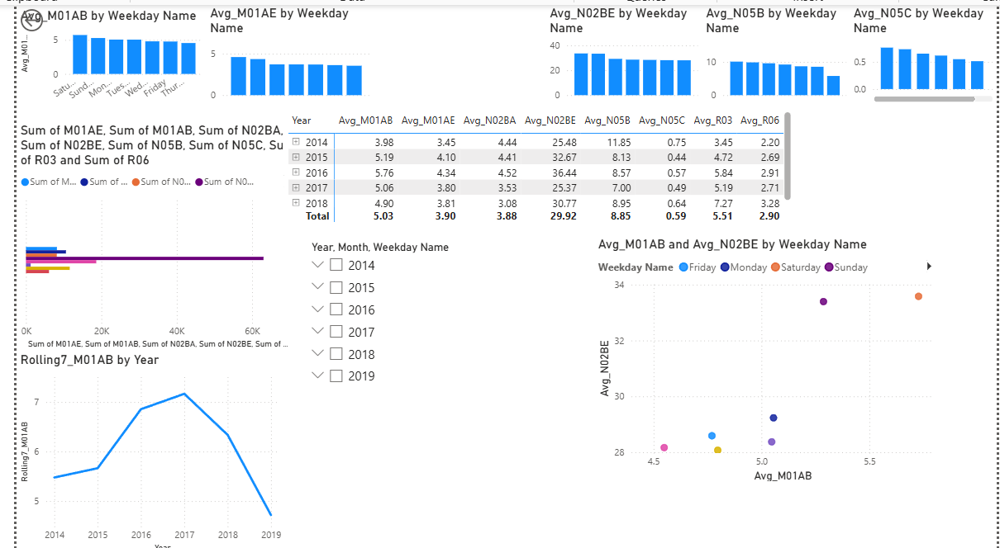

# Pharmaceutical Drug Sales - Exploratory Data Analysis (Power BI)

An interactive Power BI dashboard performing **Exploratory Data Analysis (EDA)** on a pharmaceutical daily sales dataset. The report analyzes sales trends, weekly patterns, and correlations across **8 drug categories** classified by [ATC codes](https://en.wikipedia.org/wiki/Anatomical_Therapeutic_Chemical_Classification_System).

---

## Dataset

The dataset (`salesdaily`) contains daily sales records for pharmaceutical drugs, with each column representing a different ATC drug category:

| ATC Code | Drug Category | Therapeutic Area |
|----------|--------------|-----------------|
| **M01AB** | Anti-inflammatory (Acetic acid derivatives) | Musculoskeletal — e.g., Diclofenac |
| **M01AE** | Anti-inflammatory (Propionic acid derivatives) | Musculoskeletal — e.g., Ibuprofen |
| **N02BA** | Salicylates | Nervous System — e.g., Aspirin |
| **N02BE** | Anilides | Nervous System — e.g., Paracetamol |
| **N05B** | Anxiolytics | Nervous System — e.g., Diazepam |
| **N05C** | Hypnotics and Sedatives | Nervous System — e.g., Zolpidem |
| **R03** | Anti-asthmatics | Respiratory System |
| **R06** | Antihistamines | Respiratory System |

---

## Dashboard Overview

The Power BI report contains the following visualizations on a single interactive page:

### Visuals Included

| # | Chart Type | Description |
|---|-----------|-------------|
| 1 | **Clustered Bar Chart** | Total sales comparison across all 8 drug categories |
| 2 | **Line Chart** | 7-day rolling average trend for M01AB sales over time (Year → Quarter → Month → Day drill-down) |
| 3 | **Clustered Column Chart** | Average M01AB (Diclofenac) sales by weekday |
| 4 | **Clustered Column Chart** | Average M01AE (Ibuprofen) sales by weekday |
| 5 | **Clustered Column Chart** | Average N02BE (Paracetamol) sales by weekday |
| 6 | **Clustered Column Chart** | Average N05B (Anxiolytics) sales by weekday |
| 7 | **Clustered Column Chart** | Average N05C (Sedatives) sales by weekday |
| 8 | **Pivot Table** | Monthly average sales breakdown by year for all drug categories |
| 9 | **Scatter Plot** | Correlation between Avg M01AB and Avg N02BE sales by weekday |
| 10 | **Slicer** | Interactive filters for Year, Month, and Weekday |

### Screenshots





---

## Key Analyses

### 1. Total Sales Distribution
A clustered bar chart compares the aggregate sales volume across all 8 drug categories, revealing which therapeutic areas drive the highest demand.

### 2. Time Series Trend
A line chart with a **7-day rolling average** smooths daily fluctuations in M01AB sales, enabling identification of seasonal trends and long-term patterns with full date hierarchy drill-down (Year → Quarter → Month → Day).

### 3. Weekday Patterns
Five separate column charts analyze average daily sales by weekday for key drug categories (M01AB, M01AE, N02BE, N05B, N05C), uncovering day-of-week demand patterns relevant for inventory planning.

### 4. Monthly Breakdown
A pivot table provides a detailed year-by-month view of average sales for all 8 drugs, supporting period-over-period comparisons.

### 5. Correlation Analysis
A scatter plot explores the relationship between anti-inflammatory (M01AB) and analgesic (N02BE) sales, segmented by weekday, to identify potential co-prescription or cross-demand patterns.

### 6. Interactive Filtering
Slicers for **Year**, **Month**, and **Weekday** enable dynamic exploration of the data across all visuals simultaneously.

---

## How to Use

### Prerequisites
- [Power BI Desktop](https://powerbi.microsoft.com/desktop/) (free download)

### Steps
1. Clone the repository:
   ```bash
   git clone https://github.com/0xfatima/portfolio-1-power-Bi-project.git
   ```
2. Open `EDA_Assignment.pbix` in Power BI Desktop
3. Use the slicers to filter by Year, Month, or Weekday
4. Hover over charts for tooltips and detailed values
5. Use the date hierarchy drill-down on the line chart for granular time analysis

---

## Project Structure

```
├── EDA_Assignment.pbix    # Power BI report file
└── README.md              # This file
```

---

## Tools & Technologies

- **Power BI Desktop** — Data modeling, DAX measures, and interactive visualizations
- **DAX** — Calculated columns (rolling averages, weekday averages, date hierarchy)
- **Power Query** — Data transformation and preprocessing

---

## Author

Fatima Azeemi

---

## License

This project is for educational and portfolio purposes.
